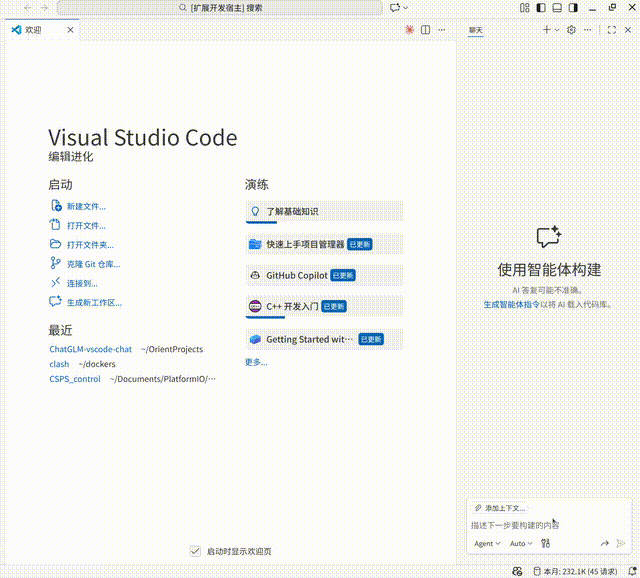

# ChatGLM Router for GitHub Copilot Chat

A VS Code extension forked from Hugging Face's `huggingface-vscode-chat` project, modified to integrate **ChatGLM** (with Coding and General endpoints) into GitHub Copilot Chat.

---

## Compatibility

*Due to limited testing resources, compatibility testing may not be exhaustive. Please report any issues on GitHub or in the comments section, and I will address them promptly.*

## AI Assistance Statement

*The development of this plugin utilized ChatGLM Coding to complete most of the API adaptation work.*

---

## Demo



## Quick Start

1. Install the ChatGLM Router extension (search for "ChatGLM Router" in VS Code extensions)
2. Open VS Code Copilot Chat interface (Ctrl/Cmd + Shift + A)
3. Click the model picker and click "Manage Models..."
4. Find "ChatGLM Router" and click "Manage ChatGLM Router"
5. Select Provider (GLM Coding) and enter API Key (get one from [https://open.bigmodel.cn/](https://open.bigmodel.cn/))
6. Choose the models you want to add to the model picker

---

## 📋 Roadmap

**Planned features for future releases:**

- [ ] **Token Alias Support** - Use custom API endpoints while maintaining unified token billing
- [ ] **Multiple Custom Providers** - Support for other OpenAI-compatible APIs (Azure OpenAI, local LLMs, etc.)
- [ ] **Streaming Token Usage** - Real-time token count display during chat
- [ ] **Usage Cost Estimation** - Calculate API costs based on token consumption
- [ ] **Export Usage Reports** - Export statistics to CSV/JSON for further analysis
- [ ] **Usage Alerts** - Notify when approaching API quota limits
- [ ] **Multi-language Model Names** - Support for models with non-English identifiers

*Have a suggestion? Feel free to open an issue on GitHub!*

---

## 💖 Support This Project

**Enjoy using this extension?** Your support helps me continue developing and maintaining it!

🚀 **Get GLM Coding Premium at a Discount** - Use my referral link to get a special deal on GLM Coding subscription:
- **20+ Programming Tools**: Seamlessly supports Claude Code, Cline, and more
- **Enhanced Coding Power**: Supercharge your development workflow
- **Limited Time Offer**: Exclusive discount for new users

[Get GLM Coding Premium →](https://www.bigmodel.cn/glm-coding?ic=WLKPUYCV8E)


*By subscribing through this link, you get a premium experience while supporting the development of this extension at no extra cost. Thank you for your support! 🙏*

---

## Available Models

### ChatGLM Coding (Default)
- Optimized for code generation and programming tasks
- Endpoint: `https://open.bigmodel.cn/api/coding/paas/v4`

### ChatGLM General (Optional)
- For general chat and non-coding tasks
- Endpoint: `https://open.bigmodel.cn/api/paas/v4/`
- Enable in settings if needed (disabled by default)
- Same models available, optimized for conversational AI

### Custom Providers (Coming Soon)
- Custom provider support is under development
- For custom API needs, please refer to `OAI Compatible Provider for Copilot`

## Configuration

### API Key

Configure your ChatGLM API key via the command palette:
- Press `Ctrl/Cmd + Shift + P`
- Run "ChatGLM Router: Manage ChatGLM Router"
- Select "ChatGLM (Coding & General)"
- Enter your API key from [https://open.bigmodel.cn/](https://open.bigmodel.cn/)

### Clear API Key

Remove your stored ChatGLM API key:
- Run "ChatGLM Router: Clear ChatGLM API Key" to delete the stored API key
- You will need to re-enter your API key to use the extension after clearing it

### Model Selection

Models are prefixed with their provider:
- `glm-4.7 (ChatGLM Coding)` - ChatGLM Coding endpoint (default, recommended for VS Code)
- `glm-4.7 (ChatGLM General)` - ChatGLM General endpoint (enable in settings first)

**Note**: If a ChatGLM provider does not have an API key configured, it will still appear in the model picker. Selecting or using that model will prompt you to enter an API key (when not in silent mode).

### Settings

Configure in VS Code Settings under `chatglmRouter`:

| Setting | Options | Default | Description |
|---------|---------|---------|-------------|
| `defaultProvider` | chatglm-coding, chatglm-general | chatglm-coding | Default provider to use |
| `enabledProviders` | Array of providers | [chatglm-coding] | Which providers to enable |
| `statistics.enabled` | boolean | true | Enable usage statistics tracking |
| `statistics.statusBar.enabled` | boolean | true | Show statistics in status bar |
| `statistics.modelTooltip.enabled` | boolean | true | Show usage in model tooltips |

**Note**: ChatGLM General is disabled by default. Enable it in settings if you need conversational AI capabilities.

For detailed statistics settings, see [Statistics Settings](#statistics-settings) below.

## Usage Statistics

Track your API usage with built-in statistics:

### Real-time Status Bar
- Weekly and monthly token usage displayed in VS Code status bar
- Auto-updates after each conversation request
- Hover to see detailed statistics
- Click to view full statistics

### Model Usage in Tooltip
- Hover over models in the picker to see historical usage
- Shows total tokens, request count, and last used time
- Helps you track which models you use most

### View Statistics
- Run "ChatGLM Router: Show Usage Statistics" command
- View total requests and tokens per provider
- See detailed per-model usage
- Refresh statistics with confirmation feedback

### Reset Statistics
- Run "ChatGLM Router: Reset Usage Statistics" command
- Clears all stored usage data

### Statistics in Output
- Run "ChatGLM Router: Show Statistics in Output" command
- Displays detailed statistics in an output channel

**Note**: Statistics are stored locally in VS Code's global state and are estimates (4 chars ≈ 1 token).

### Statistics Settings {#statistics-settings}

Configure in VS Code Settings under `chatglmRouter.statistics`:

| Setting | Options | Default | Description |
|---------|---------|---------|-------------|
| `statusBar.enabled` | boolean | true | Show statistics in status bar |
| `statusBar.displayMode` | normal, compact, minimal | normal | Status bar display mode |
| `statusBar.timeRange` | week, month, both | both | Time range to display |
| `statusBar.showRequestCount` | boolean | true | Show request count in status bar |
| `modelTooltip.enabled` | boolean | true | Show usage in model tooltips |

## Development

```bash
git clone https://github.com/OrientLuna/ChatGLM-vscode-chat
cd ChatGLM-vscode-chat
npm install
npm run compile
```

Press **F5** to launch an Extension Development Host for testing.

### Common Scripts
- **Build**: `npm run compile`
- **Watch**: `npm run watch`
- **Lint**: `npm run lint`
- **Format**: `npm run format`
- **Test**: `npm run test`
- **Package**: `npm run package` (generates .vsix file)

## Architecture

- **Multi-Provider Design**: Supports ChatGLM Coding and ChatGLM General
- **Provider Registry**: Built-in providers in `src/config.ts`
- **Statistics Tracking**: Usage data tracked in `src/statistics.ts`
- **API-First Model List**: Fetches latest models from provider APIs
- **Streaming Response**: SSE-like streaming with tool call support

## Troubleshooting

### Models not appearing
1. Check that your ChatGLM API key is configured correctly
2. Run "ChatGLM Router: Manage ChatGLM Router" to verify API key
3. Check VS Code developer console for errors (Help → Toggle Developer Tools)

### API Errors
1. Verify your API key has the required permissions
2. Check that the selected model is available on your chosen endpoint
3. Ensure you have sufficient API credits/quotas

### ChatGLM Coding vs General
- Use **ChatGLM Coding** for code-related tasks (recommended for VS Code)
- Use **ChatGLM General** for conversational AI and non-coding tasks
- Enable ChatGLM General in settings: `chatglmRouter.enabledProviders` → add `chatglm-general`

## Requirements

- VS Code 1.104.0 or higher
- ChatGLM API key from [https://open.bigmodel.cn/](https://open.bigmodel.cn/)

## License

MIT License © OrientLuna

## Support

- Report issues: [GitHub Issues](https://github.com/OrientLuna/ChatGLM-vscode-chat/issues)
- ChatGLM Documentation: [https://open.bigmodel.cn/](https://open.bigmodel.cn/)
